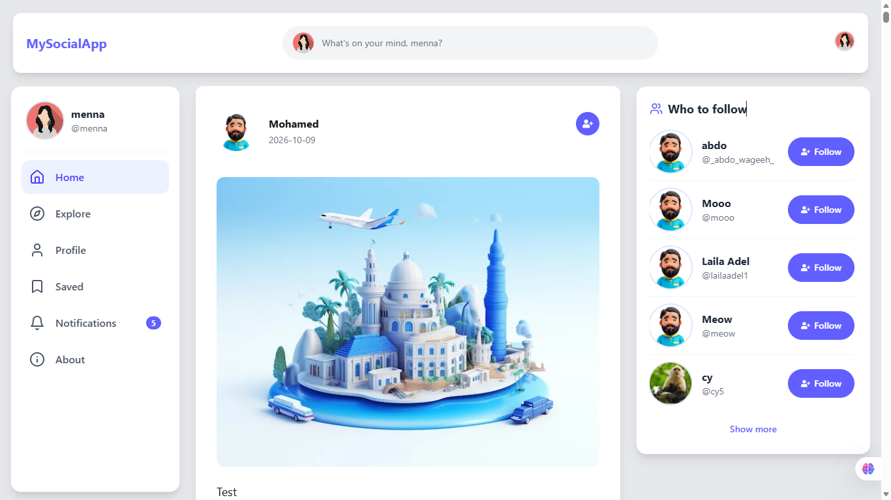
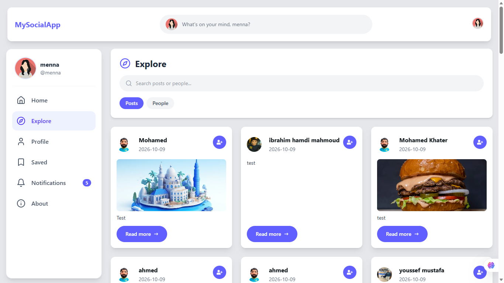
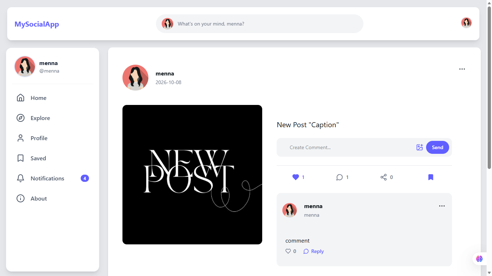
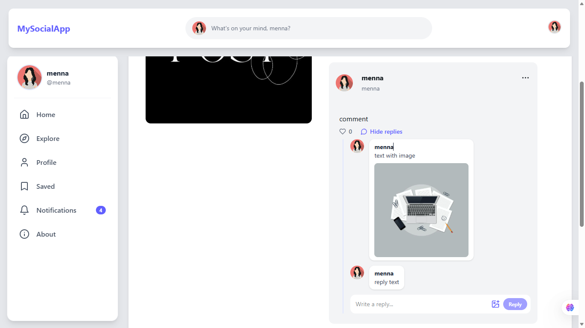
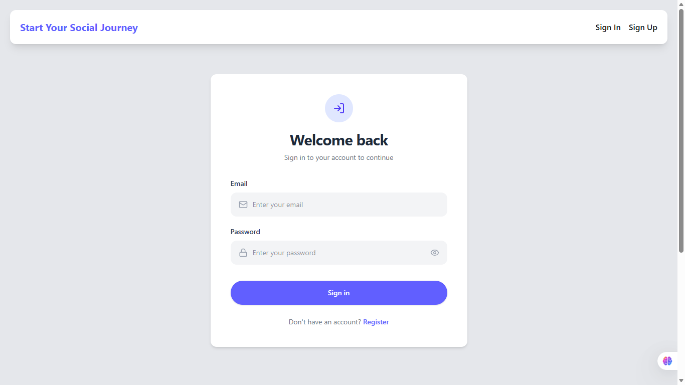
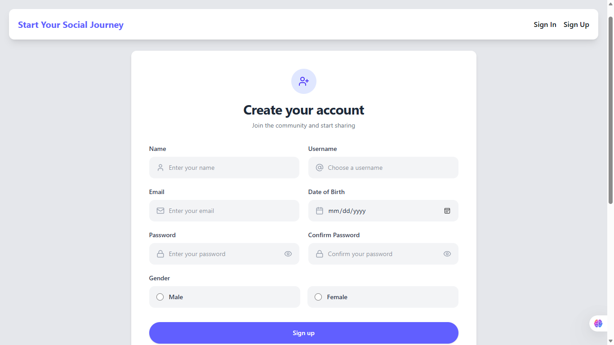

# MySocialApp — Social Media Web Application

A full-featured, responsive social media web application built from scratch with **React**. Users can share content, interact through likes, comments, and nested replies, connect with other users, explore posts, and manage their profiles.

The project focuses on building interactive user experiences, integrating a REST API, managing server state efficiently, and building reusable UI components.

**[Live Demo](https://social-app-green-three.vercel.app)**
**[GitHub Repository](https://github.com/menna-hedia/SocialApp)**
**[Demo Video](https://bit.ly/4yweNpD)**

---

## Screenshots

### Desktop

| Home Feed | Explore |
| --- | --- |
|  |  |

| Profile | Notifications |
| --- | --- |
|  |  |

| Post Details | Comments and Replies |
| --- | --- |
|  |  |

| Login | Register |
| --- | --- |
|  |  |

---

## Table of Contents

* [Overview](#overview)
* [Features](#features)
* [Technical Highlights](#technical-highlights)
* [Tech Stack](#tech-stack)
* [Project Structure](#project-structure)
* [Getting Started](#getting-started)
* [Available Scripts](#available-scripts)
* [Environment and API](#environment-and-api)
* [Future Improvements](#future-improvements)
* [Author](#author)
* [License](#license)

---

## Overview

MySocialApp provides a social networking experience where authenticated users can publish content, engage with posts and comments, follow other users, discover new content, and manage their personal profiles.

The application integrates with the **Route Posts API** for authentication and all social interactions.

---

## Features

### 1. Authentication and Access Control

* **User Registration:** Sign up with name, username, email, date of birth, gender, and password, with full form validation.
* **Secure Sign In:** JWT-based authentication, with the stored token decoded and validated on load.
* **Protected Routes:** Authenticated pages are restricted to logged-in users.
* **Guest-Only Routes:** Logged-in users cannot access the login and registration pages.
* **Password Management:** Change your password with confirmation.
* **Custom 404 Page:** A dedicated page for unmatched routes.

### 2. Posts and Content Management

* **Create Posts:** Publish text, images, or both.
* **Edit Posts:** Update content and replace or remove attached images.
* **Delete Posts:** Remove your own posts.
* **Share Posts:** Repost with an optional caption; the original post is preserved inside the shared one.
* **Like and Unlike:** Instant UI updates through optimistic rendering.
* **Bookmarks:** Save posts and revisit them on a dedicated Saved page.
* **Post Details:** A dedicated page for a single post and its discussion.

### 3. Comments and Nested Replies

* Add comments with text or images.
* Edit and delete your own comments.
* Like and unlike comments.
* Reply to comments with text or images.
* Open comments directly from the feed in a modal, or view the full discussion on the post details page.

### 4. Social Connections

* Follow and unfollow users.
* Discover accounts through the **Who to Follow** section, with Show More / Show Less.
* Visit any user's public profile to browse their posts and stats.
* View followers and following lists in a modal.

### 5. Explore and Search

* Search for posts and people.
* Switch between Posts and People tabs.
* Load more results with a Show More interaction.

### 6. Notifications

* Dedicated notifications page with All and Unread tabs.
* Mark individual notifications, or all of them, as read.
* Unread badge in the sidebar, refreshed automatically every 30 seconds.

### 7. Profile Management

* Upload and update the profile photo and cover photo, with file type and size validation.
* Profile stats: posts, followers, following, and saved posts.
* Browse all of your posts in one place.

### 8. UI and User Experience

* Fully responsive interface with a fixed sidebar on desktop and a mobile navigation menu.
* Loading, empty, and error states across all pages.
* Toast notifications for the outcome of every action.
* Automatic scroll-to-top on route change.
* Cached server data with automatic refetching.

---

## Technical Highlights

### API Integration
* Integrates with a REST API using Axios.
* Sends JWT tokens through request headers.
* Handles asynchronous operations and response states, including unexpected API response shapes.

### Server-State Management
* Uses TanStack Query for caching, invalidation, and automatic refetching.
* Reduces unnecessary requests and keeps the UI in sync with the server.

### Optimistic UI Updates
* Likes update instantly and roll back if the request fails, improving perceived performance.

### Routing and Access Control
* React Router organizes navigation.
* Protected and guest-only route wrappers separate access levels.

### Form Handling
* React Hook Form manages state, validation, and submission for registration, login, and password change.

### Component-Based Architecture
* Pages and reusable components live in dedicated directories.
* Authentication and profile state are separated into React contexts.
* Shared logic is extracted into custom hooks and utility functions.

---

## Tech Stack

| Category | Technologies |
| --- | --- |
| Frontend Framework | React |
| Build Tool | Vite |
| Language | JavaScript (JSX) |
| Styling | Tailwind CSS, HeroUI |
| Routing | React Router |
| API Communication | Axios, REST API |
| Server-State Management | TanStack Query |
| Form Management | React Hook Form |
| Authentication | JWT, jwt-decode |
| Notifications | React Toastify |
| Loading Indicators | React Spinners |
| Icons | React Icons |
| Deployment | Vercel |

---

## Project Structure

```text
src/
├── Components/                # Grouped by feature for readability
│   ├── Auth/                  # Login, Register, ChangePassword
│   ├── Feed/                  # Home, PostCard, PostActions, PostCreation, PostUpdate,
│   │                          # PostDetails, SharedPost, ShareModal
│   ├── Comments/              # CommentCard, CommentCreation, CommentUpdate,
│   │                          # CommentsModal, RepliesSection
│   ├── Social/                # FollowButton, FollowSuggestions, FollowListModal,
│   │                          # ExplorePage, UserProfile
│   ├── Profile/               # Profile, ProfileStats, CoverPhoto, ProfilePhotoUpload
│   ├── Pages/                 # NotificationsPage, BookmarksPage, About, NotFound
│   ├── Layout/                # Layout, Navbar, LeftSidebar, Footer, ScrollToTop
│   └── Routing/               # RoutesProtector, RoutesAntiProtector
├── context/
│   ├── AuthContext.jsx        # JWT token and current user id
│   └── ProfileContext.jsx     # Logged-in user's profile data
├── hooks/
│   ├── useBookmarks.js        # Saved posts query
│   └── useNotifications.js    # Notifications and unread-count queries
├── utils/
│   ├── extractList.js         # Normalizes list responses from the API
│   └── getOriginalPost.js     # Finds the original post inside a shared post
├── App.jsx                    # Routes and application providers
├── main.jsx                   # Application entry point
└── index.css                  # Tailwind and HeroUI setup
```

---

## Getting Started

### Prerequisites

* [Node.js](https://nodejs.org/) version 20 or later
* npm (included with Node.js)
* Git

### Installation

```bash
# 1. Clone the repository
git clone https://github.com/menna-hedia/SocialApp.git

# 2. Navigate to the project directory
cd SocialApp

# 3. Install dependencies
npm install

# 4. Start the development server
npm run dev
```

Then open http://localhost:5173 in your browser.

---

## Available Scripts

| Command | Description |
| --- | --- |
| `npm run dev` | Start the development server |
| `npm run build` | Create an optimized production build |
| `npm run preview` | Preview the production build locally |
| `npm run lint` | Run ESLint |

---

## Environment and API

MySocialApp uses the **Route Posts API** for authentication and social features.

**Base URL:** `https://route-posts.routemisr.com`

Authenticated requests send the JWT through the `token` HTTP header.

The API covers:

* User registration and login
* Profile and account operations
* Post creation and management
* Likes, comments, replies, and sharing
* Following and user discovery
* Bookmarks and notifications

The app depends on the API's availability for its server-backed features.

---

## Future Improvements

* Centralize the API base URL and auth headers in a shared Axios instance and an environment variable.
* Add automated unit and component tests.
* Add end-to-end tests for authentication and core social workflows.
* Improve accessibility with keyboard navigation and screen-reader support.
* Enhance error handling for network failures and expired sessions.
* Improve performance with code splitting and lazy loading.

---

## Author

**Menna Hedia**
Frontend Developer | Computer Science Graduate

* **GitHub:** [@menna-hedia](https://github.com/menna-hedia)
* **LinkedIn:** [Menna Hedia](https://www.linkedin.com/in/menna-hedia-1176b924b/)

---

## License

This project was developed for learning, practice, and portfolio purposes.