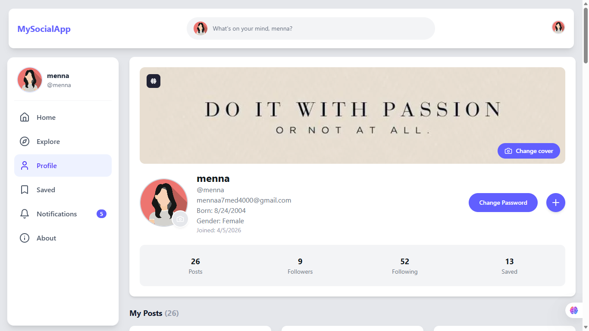
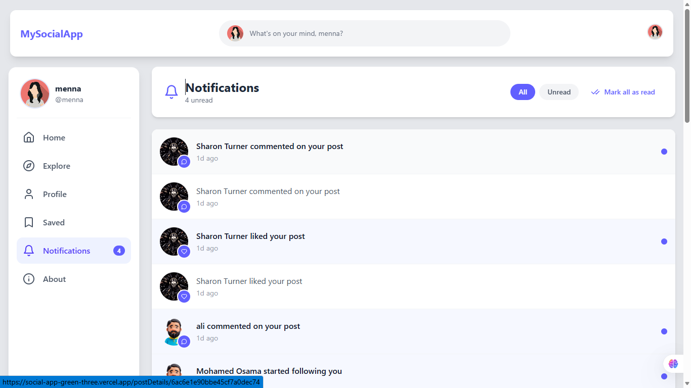

<div align="center">

# MySocialApp

A responsive social media app built with React, with posts, comments, follows, saved posts, and notifications.

**[Live Demo](https://social-app-green-three.vercel.app)**


</div>

## Features

- **Authentication:** register, sign in, and protected routes with JWT
- **Posts:** create, edit, and delete posts with text and images
- **Comments and replies:** comment with images, edit or delete comments, and reply to any comment
- **Reactions:** like posts and comments, and share posts
- **Saved posts:** bookmark posts and view them on a dedicated page
- **Follow system:** follow or unfollow users, open their profiles, and discover people from suggestions
- **Notifications:** unread count, mark one or all as read
- **Profile:** personal stats, your posts, profile photo upload, and change password
- **Responsive design:** three-column layout on desktop and a mobile menu on small screens

## Tech Stack

| Area | Tools |
| --- | --- |
| Framework | React 19, Vite, React Router |
| Data | TanStack Query, Axios |
| Forms | React Hook Form |
| UI | Tailwind CSS, HeroUI, Framer Motion, React Icons, React Toastify |

## Screenshots

| Feed | Profile | Notifications |
| --- | --- | --- |
|  |  |  |

## Getting Started

```bash
git clone https://github.com/menna-hedia/SocialApp.git
cd SocialApp
npm install
npm run dev
```

Open `http://localhost:5173`.

Other scripts: `npm run build` (production build) and `npm run preview` (preview the build).

## Demo Account

| Email | Password |
| --- | --- |
| `[DEMO_EMAIL]` | `[DEMO_PASSWORD]` |

## API

The app uses the Route Academy Posts API: `https://route-posts.routemisr.com`

## Author

**Menna Allah Hedia**  
[LinkedIn](https://linkedin.com/in/menna-hedia-1176b924b) · [GitHub](https://github.com/menna-hedia)